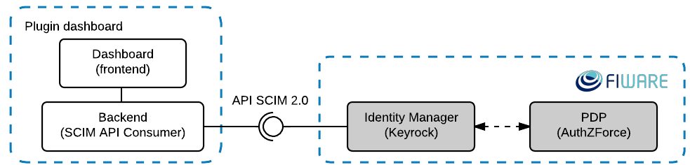
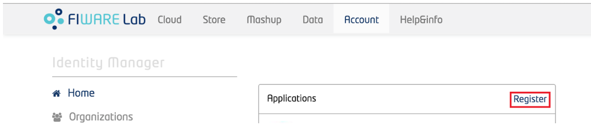
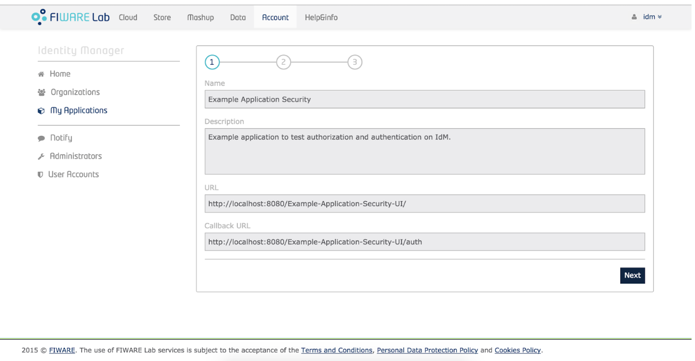
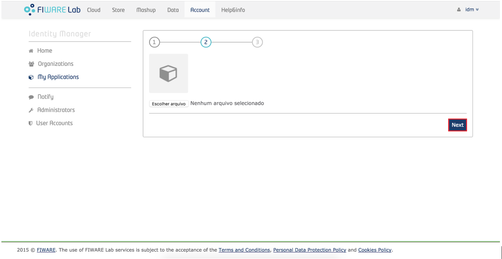
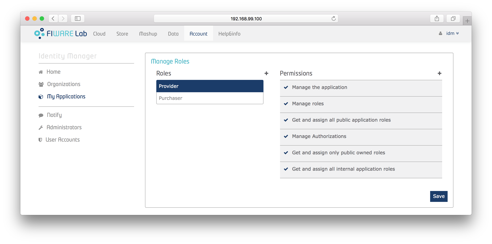
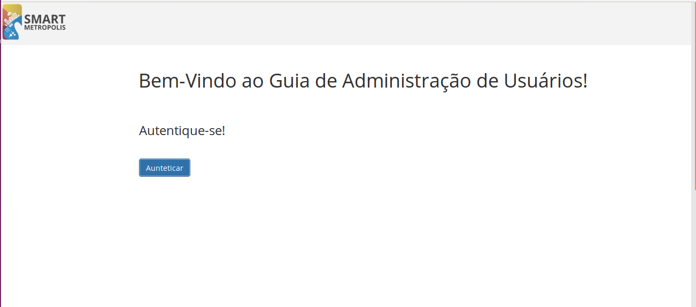
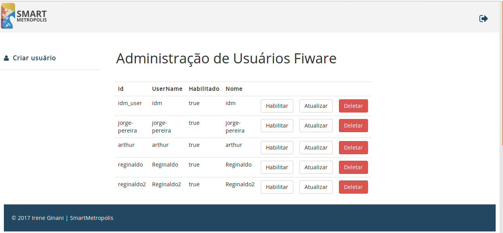

*************************************
Tutorial para Ferramente Gui-Scim 
*************************************

.. contents::
   :local:
   :depth: 3

.. _autores:

Autores
=======

- Irene Ginani Costa Pinheiro
- Carlos Eduardo da Silva
    
Introdução
===============
    

O desenvolvimento de aplicações para cidades inteligentes envolve um número de tecnologias, tais como Internet das Coisas (IoT), Computação em Nuvem e Big Data, que necessitam de uma infraestrutura de suporte que sirva de base para o desenvolvimento de tais aplicações. 
Nesse contexto, a plataforma `FIWARE <https://www.fiware.org/>`_ surge como uma candidata a infraestrutura de apoio ao desenvolvimento de aplicações e serviços de Cidades Inteligentes, oferecendo uma gama de serviços comuns para o desenvolvimento de soluções para Cidades Inteligentes, tratando diversos aspectos, como por exemplo, mecanismos de Computação em nuvem, IoT, segurança, entre outros.

Sabemos que é altamente desejado que informações, aplicativos, ou softwares sejam acessados somente por aqueles autorizados para tal.Para isso, existem vários mecanismos que lidam com diferentes aspectos de segurança da informação, tais como autenticação, políticas de segurança, entre outros. 
A plataforma Fiware foi projetada para considerar estes aspectos em uma abordagem secure by design, onde mecanismos de segurança são fornecidos através de componentes, também chamados de Generic Enablers (GEs), que podem ser utilizados por aplicações ou outros componentes da plataforma.

No contexto do projeto `Smart Metrópolis <http://smartmetropolis.imd.ufrn.br/>`_, onde trabalhamos com as GEs FIWARE de autenticação e autorização, identificamos a necessidade de uma interface para o gerenciamento de usuários.
Desse modo, este repositório apresenta uma proposta de interface gráfica para a gerência de usuários no Identity Management GE (IdM). 
Para tal, desenvolvemos uma GUI Web Python que consome as APIs fornecidas pelo IdM (SCIM 2.0, user_registration, etc) e traz funcionalidades ainda não cobertas pela interface atual do Keyrock.    
    
Conhecendo a GUISCIM
=======================

A ferramenta em questão trata-se de uma interface gráfica Web para a gestão de usuários, junto com
um backend que permite abstrair o protocolo de acesso REST a `API <https://keyrock.docs.apiary.io/#reference>`_ oferecida
pelo Keyrock. A figura abaixo apresenta uma visão geral da arquitetura da ferramenta proposta. 

Com isso, a interface Web pode ser utilizada para gerenciar qualquer serviço de identidade
compatı́vel com a API em questão, seu dashboard é feita em Python usando o framework Django, enquanto
que o backend consome a API REST SCIM fornecida pelo Keyrock. Dessa forma é possível implementar as funcionalidades que não são cobertas pelo keyrock. Segue abaixo a lista dessas funcionalidades:

- Criar Usuários
- Atualizar Usuários
- Deletar Usuários
- Habilitar Usuários

Guia de Instalação para utilizar a ferramenta
==============================================

Agora iremos aprender a instalar o ambiente que você utilizará para rodar a ferramenta desejada

Instalando o back-end: Docker (Infraestura com GE's FIWARE)
-----------------------------------------------------------

Antes de colocar a infra em execução é necessário realizar algumas instalações:

- Para a instalação do docker siga o tutorial disponível em: `Instalação do Docker <https://www.digitalocean.com/community/tutorials/como-instalar-e-usar-o-docker-no-ubuntu-16-04-pt>`_

- Para instalação do docker-compose siga o tutorial disponível em: `Instalação do docker-compose <https://www.digitalocean.com/community/tutorials/how-to-install-docker-compose-on-ubuntu-16-04>`_

- Para instalação do docker-machine siga o tutorial disponível em: `Instalação do docker-machine <https://www.digitalocean.com/community/tutorials/how-to-provision-and-manage-remote-docker-hosts-with-docker-machine-on-ubuntu-16-04>`_

Após a instalação é necessário fazer clone ou download deste repositório:

- Faça clone deste repositório: `GuiScim-Tutorial <https://github.com/FIoT-Client/GuiScim-Tutorial>`_

Configuração do ambiente virtual para o back-end
-------------------------------------------------

Após efetuar os passos da instalação é necessário configurar o ambiente para que possamos executar a infraestrutura necessária.

- No arquivo GuiScim-tutorial/infra/security-componentes/keyrock/files/local_settings.py altere o valor do atributo na linha 629, onde consta.::
				
	ACCESS_CONTROL_URL = 'localhost:8080'

- Para o IP da máquina que a infra será executada, tendo então.::
				
	ACCESS_CONTROL_URL = 'IP-MÁQUINA:8080'

Executando a infraestrutura
----------------------------

Após efetuar os passos de Instalação e Configuração, para executar a infraestrutura é necesário:

- Acessar a pasta GuiScim-Tutorial/infra/security-components e efetuar o seguinte comando.::
					
	sudo docker-compose build

- Logo após o término dessa execução é necessário efetuar.::

	sudo docker-compose up

Criando uma Aplicação no FIWARE
================================

Em seu navegador acesse o endereço do <IP-Máquina>:8000 acessando assim a interface do keyrock. Para conseguir efetuar o login utilize a seguinte conta.:: 

    Usuário: idm
    Senha: idm
 
Ao entrar na conta de administrador cadastre uma nova aplicação seguindo as instruções abaixo:
				 
- Para registrar uma aplicação clique no botão "register" como mostra a figura abaixo: 

- Então siga os três passos para concluir o registro, inicialmente cadastre o nome da aplicação, sua descrição, a url da aplicação e a url de redirecionamento para onde o token de usuário será enviado.

- Aperte em "next" e escolha uma imagem para a aplicação, essa imagem é opcional

- Por fim, identifique a política de acesso para a sua aplicação, você poderá criar novas permissões e papéis através dessa interface.

- Após o término da configuração teremos essa página:
.. image:: documentacao/source/imagens/infos-cadastradas.png

Instalando o front-end : Docker (GuiScim)
=================================================

Antes de exercutarmos a ferramenta desejada é necessário realizar algumas configurações, descritas abaixo.

            
Configuração do ambiente virtual para front-end
------------------------------------------------

Abra o arquivo oauth_fiware.py disponível em GuiScim-tutorial/guiscim/ faça as seguintes modificações.::
	
	self.client_id = 'ID-APP-FIWARE'  
    self.client_secret = 'ID-SECRET-APP-FIWARE'

Posteriormente é necessário mudar as seguintes linhas.::

	self.redirect_uri = 'http://IP-APP:5055/auth' ;

    self.proxy_address = "http://IP-APP:80/" ;
    self.idm_address = 'http://IP-APP:8000/' ;

No arquivo views.py disponível em GuiScim-tutorial/guiscim/ realize a seguinte modificação.::

	keystone_url = "http://IP-APP:5000/"

Executando a Aplicação Web
---------------------------

Após efetuar os passos anteriores, para rodar a aplicação desejada é necessário que:

- Acessar a pasta GuiScim-tutorial/ e efetuar o seguinte comando.::
	
	sudo docker-compose up

- Acessar a pasta GuiScim-tutorial/ e efetuar o seguinte comando.::

	sudo docker-compose up

Usando a Aplicação com os dispositivos de Segurança
===================================================

Com as duas partes em funcionamento, acesse o link da sua aplicação que estará disponível em.::

    http://IP-APP:5055/guiscim

Então, você chegará na seguinte tela:

Após autenticar-se com o usuário e senha mencionado acima teremos a seguinte tela:

A tela acima irá exibir todos os usuários e terá ao lado os botões com ações que podem ser efetuadas por esses usuários, assim você poderá
habilitar, deletar ou atualizar o usuário. Ao lado esquerdo teremos um botão que leva a página de criação de usuários, onde você digitará, o novo usuário e senha para efetuar sua criação. 

